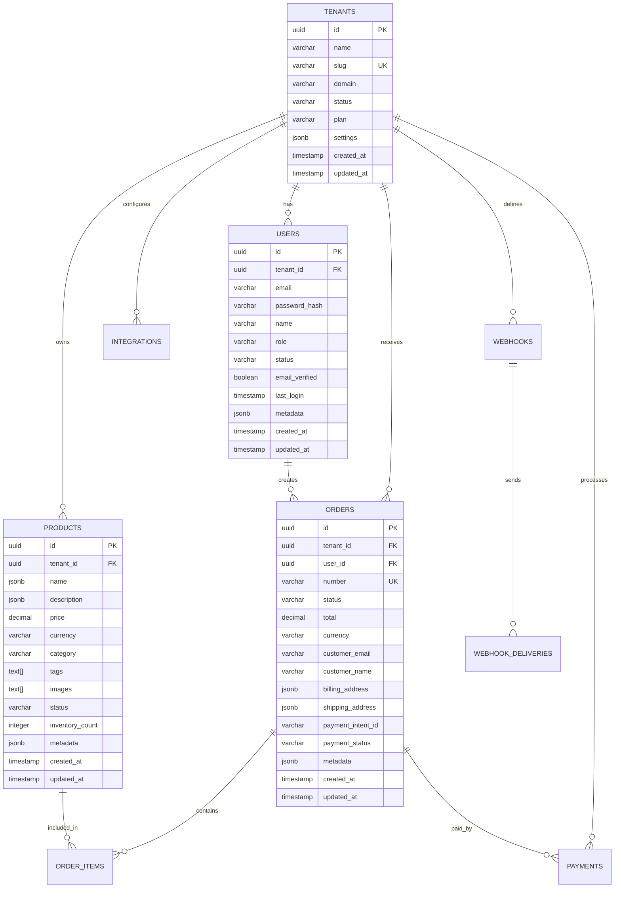

# Database Schema Documentation

## Overview

The BrainSAIT Store uses PostgreSQL with SQLAlchemy ORM for data persistence. The database schema is designed for multi-tenant architecture with proper isolation and scalability.

## Database Design Principles

### Multi-Tenant Architecture
- **Shared Database, Shared Schema**: Cost-effective for small to medium tenants
- **Tenant Isolation**: Row-level security with tenant_id foreign keys
- **Data Partitioning**: Future-ready for horizontal scaling

### Performance Optimization
- **Indexing Strategy**: Optimized queries with proper indexes
- **Connection Pooling**: Efficient database connections
- **Read Replicas**: Planned for read-heavy workloads

## Core Tables

### Tenants
```sql
CREATE TABLE tenants (
    id UUID PRIMARY KEY DEFAULT gen_random_uuid(),
    name VARCHAR(255) NOT NULL,
    slug VARCHAR(100) UNIQUE NOT NULL,
    domain VARCHAR(255),
    status VARCHAR(50) DEFAULT 'active',
    plan VARCHAR(50) DEFAULT 'starter',
    settings JSONB DEFAULT '{}',
    created_at TIMESTAMP WITH TIME ZONE DEFAULT NOW(),
    updated_at TIMESTAMP WITH TIME ZONE DEFAULT NOW()
);

-- Indexes
CREATE INDEX idx_tenants_slug ON tenants(slug);
CREATE INDEX idx_tenants_status ON tenants(status);
CREATE INDEX idx_tenants_plan ON tenants(plan);
```

### Users
```sql
CREATE TABLE users (
    id UUID PRIMARY KEY DEFAULT gen_random_uuid(),
    tenant_id UUID NOT NULL REFERENCES tenants(id) ON DELETE CASCADE,
    email VARCHAR(255) NOT NULL,
    password_hash VARCHAR(255),
    name VARCHAR(255),
    role VARCHAR(50) DEFAULT 'user',
    status VARCHAR(50) DEFAULT 'active',
    email_verified BOOLEAN DEFAULT FALSE,
    last_login TIMESTAMP WITH TIME ZONE,
    metadata JSONB DEFAULT '{}',
    created_at TIMESTAMP WITH TIME ZONE DEFAULT NOW(),
    updated_at TIMESTAMP WITH TIME ZONE DEFAULT NOW(),
    
    UNIQUE(tenant_id, email)
);

-- Indexes
CREATE INDEX idx_users_tenant_id ON users(tenant_id);
CREATE INDEX idx_users_email ON users(email);
CREATE INDEX idx_users_status ON users(status);
CREATE INDEX idx_users_role ON users(role);
```

### Products
```sql
CREATE TABLE products (
    id UUID PRIMARY KEY DEFAULT gen_random_uuid(),
    tenant_id UUID NOT NULL REFERENCES tenants(id) ON DELETE CASCADE,
    name JSONB NOT NULL, -- {"en": "Product Name", "ar": "اسم المنتج"}
    description JSONB,
    price DECIMAL(10,2) NOT NULL,
    currency VARCHAR(3) DEFAULT 'USD',
    category VARCHAR(100),
    tags TEXT[],
    images TEXT[],
    status VARCHAR(50) DEFAULT 'active',
    inventory_count INTEGER DEFAULT 0,
    metadata JSONB DEFAULT '{}',
    created_at TIMESTAMP WITH TIME ZONE DEFAULT NOW(),
    updated_at TIMESTAMP WITH TIME ZONE DEFAULT NOW()
);

-- Indexes
CREATE INDEX idx_products_tenant_id ON products(tenant_id);
CREATE INDEX idx_products_category ON products(category);
CREATE INDEX idx_products_status ON products(status);
CREATE INDEX idx_products_price ON products(price);
CREATE INDEX idx_products_tags ON products USING GIN(tags);
CREATE INDEX idx_products_name ON products USING GIN(name);
```

### Orders
```sql
CREATE TABLE orders (
    id UUID PRIMARY KEY DEFAULT gen_random_uuid(),
    tenant_id UUID NOT NULL REFERENCES tenants(id) ON DELETE CASCADE,
    user_id UUID REFERENCES users(id) ON DELETE SET NULL,
    number VARCHAR(50) UNIQUE NOT NULL,
    status VARCHAR(50) DEFAULT 'pending',
    total DECIMAL(10,2) NOT NULL,
    currency VARCHAR(3) DEFAULT 'USD',
    customer_email VARCHAR(255),
    customer_name VARCHAR(255),
    billing_address JSONB,
    shipping_address JSONB,
    payment_intent_id VARCHAR(255),
    payment_status VARCHAR(50) DEFAULT 'pending',
    metadata JSONB DEFAULT '{}',
    created_at TIMESTAMP WITH TIME ZONE DEFAULT NOW(),
    updated_at TIMESTAMP WITH TIME ZONE DEFAULT NOW()
);

-- Indexes
CREATE INDEX idx_orders_tenant_id ON orders(tenant_id);
CREATE INDEX idx_orders_user_id ON orders(user_id);
CREATE INDEX idx_orders_status ON orders(status);
CREATE INDEX idx_orders_payment_status ON orders(payment_status);
CREATE INDEX idx_orders_number ON orders(number);
CREATE INDEX idx_orders_created_at ON orders(created_at);
```

### Order Items
```sql
CREATE TABLE order_items (
    id UUID PRIMARY KEY DEFAULT gen_random_uuid(),
    order_id UUID NOT NULL REFERENCES orders(id) ON DELETE CASCADE,
    product_id UUID REFERENCES products(id) ON DELETE SET NULL,
    product_name VARCHAR(255) NOT NULL,
    quantity INTEGER NOT NULL DEFAULT 1,
    price DECIMAL(10,2) NOT NULL,
    total DECIMAL(10,2) NOT NULL,
    metadata JSONB DEFAULT '{}'
);

-- Indexes
CREATE INDEX idx_order_items_order_id ON order_items(order_id);
CREATE INDEX idx_order_items_product_id ON order_items(product_id);
```

### Payments
```sql
CREATE TABLE payments (
    id UUID PRIMARY KEY DEFAULT gen_random_uuid(),
    tenant_id UUID NOT NULL REFERENCES tenants(id) ON DELETE CASCADE,
    order_id UUID REFERENCES orders(id) ON DELETE SET NULL,
    payment_intent_id VARCHAR(255) UNIQUE,
    amount DECIMAL(10,2) NOT NULL,
    currency VARCHAR(3) DEFAULT 'USD',
    status VARCHAR(50) DEFAULT 'pending',
    payment_method VARCHAR(50),
    provider VARCHAR(50), -- stripe, paypal, apple_pay
    provider_fee DECIMAL(10,2),
    net_amount DECIMAL(10,2),
    refunded_amount DECIMAL(10,2) DEFAULT 0,
    metadata JSONB DEFAULT '{}',
    processed_at TIMESTAMP WITH TIME ZONE,
    created_at TIMESTAMP WITH TIME ZONE DEFAULT NOW(),
    updated_at TIMESTAMP WITH TIME ZONE DEFAULT NOW()
);

-- Indexes
CREATE INDEX idx_payments_tenant_id ON payments(tenant_id);
CREATE INDEX idx_payments_order_id ON payments(order_id);
CREATE INDEX idx_payments_status ON payments(status);
CREATE INDEX idx_payments_provider ON payments(provider);
CREATE INDEX idx_payments_created_at ON payments(created_at);
```

## Analytics Tables

### Analytics Events
```sql
CREATE TABLE analytics_events (
    id UUID PRIMARY KEY DEFAULT gen_random_uuid(),
    tenant_id UUID NOT NULL REFERENCES tenants(id) ON DELETE CASCADE,
    event_type VARCHAR(100) NOT NULL,
    user_id UUID REFERENCES users(id) ON DELETE SET NULL,
    session_id VARCHAR(255),
    properties JSONB DEFAULT '{}',
    timestamp TIMESTAMP WITH TIME ZONE DEFAULT NOW()
);

-- Indexes for analytics queries
CREATE INDEX idx_analytics_tenant_timestamp ON analytics_events(tenant_id, timestamp);
CREATE INDEX idx_analytics_event_type ON analytics_events(event_type);
CREATE INDEX idx_analytics_user_id ON analytics_events(user_id);
```

### Revenue Metrics
```sql
CREATE TABLE revenue_metrics (
    id UUID PRIMARY KEY DEFAULT gen_random_uuid(),
    tenant_id UUID NOT NULL REFERENCES tenants(id) ON DELETE CASCADE,
    date DATE NOT NULL,
    total_revenue DECIMAL(15,2) DEFAULT 0,
    order_count INTEGER DEFAULT 0,
    customer_count INTEGER DEFAULT 0,
    average_order_value DECIMAL(10,2) DEFAULT 0,
    currency VARCHAR(3) DEFAULT 'USD',
    created_at TIMESTAMP WITH TIME ZONE DEFAULT NOW(),
    
    UNIQUE(tenant_id, date, currency)
);

-- Indexes
CREATE INDEX idx_revenue_metrics_tenant_date ON revenue_metrics(tenant_id, date);
```

## Integration Tables

### Integrations
```sql
CREATE TABLE integrations (
    id UUID PRIMARY KEY DEFAULT gen_random_uuid(),
    tenant_id UUID NOT NULL REFERENCES tenants(id) ON DELETE CASCADE,
    name VARCHAR(100) NOT NULL,
    type VARCHAR(50) NOT NULL, -- linkedin, stripe, paypal, etc.
    status VARCHAR(50) DEFAULT 'active',
    config JSONB DEFAULT '{}',
    credentials JSONB DEFAULT '{}', -- Encrypted
    last_sync TIMESTAMP WITH TIME ZONE,
    created_at TIMESTAMP WITH TIME ZONE DEFAULT NOW(),
    updated_at TIMESTAMP WITH TIME ZONE DEFAULT NOW(),
    
    UNIQUE(tenant_id, type)
);

-- Indexes
CREATE INDEX idx_integrations_tenant_id ON integrations(tenant_id);
CREATE INDEX idx_integrations_type ON integrations(type);
```

### Webhooks
```sql
CREATE TABLE webhooks (
    id UUID PRIMARY KEY DEFAULT gen_random_uuid(),
    tenant_id UUID NOT NULL REFERENCES tenants(id) ON DELETE CASCADE,
    url VARCHAR(500) NOT NULL,
    events TEXT[] NOT NULL,
    secret VARCHAR(255) NOT NULL,
    status VARCHAR(50) DEFAULT 'active',
    description TEXT,
    created_at TIMESTAMP WITH TIME ZONE DEFAULT NOW(),
    updated_at TIMESTAMP WITH TIME ZONE DEFAULT NOW()
);

-- Indexes
CREATE INDEX idx_webhooks_tenant_id ON webhooks(tenant_id);
CREATE INDEX idx_webhooks_status ON webhooks(status);
```

### Webhook Deliveries
```sql
CREATE TABLE webhook_deliveries (
    id UUID PRIMARY KEY DEFAULT gen_random_uuid(),
    webhook_id UUID NOT NULL REFERENCES webhooks(id) ON DELETE CASCADE,
    event_id UUID NOT NULL,
    event_type VARCHAR(100) NOT NULL,
    payload JSONB NOT NULL,
    response_status INTEGER,
    response_body TEXT,
    response_time INTEGER, -- milliseconds
    attempt_count INTEGER DEFAULT 1,
    delivered_at TIMESTAMP WITH TIME ZONE,
    created_at TIMESTAMP WITH TIME ZONE DEFAULT NOW()
);

-- Indexes
CREATE INDEX idx_webhook_deliveries_webhook_id ON webhook_deliveries(webhook_id);
CREATE INDEX idx_webhook_deliveries_event_type ON webhook_deliveries(event_type);
CREATE INDEX idx_webhook_deliveries_created_at ON webhook_deliveries(created_at);
```

## Relationships Diagram



## Data Migration Strategy

### Alembic Configuration
```python
# alembic/env.py
from alembic import context
from sqlalchemy import engine_from_config, pool
from app.models import Base
from app.core.config import settings

def run_migrations_online():
    configuration = context.config
    configuration.set_main_option('sqlalchemy.url', settings.DATABASE_URL)
    
    connectable = engine_from_config(
        configuration.get_section(configuration.config_ini_section),
        prefix='sqlalchemy.',
        poolclass=pool.NullPool,
    )

    with connectable.connect() as connection:
        context.configure(
            connection=connection,
            target_metadata=Base.metadata
        )

        with context.begin_transaction():
            context.run_migrations()
```

### Migration Commands
```bash
# Create new migration
alembic revision --autogenerate -m "Add new table"

# Apply migrations
alembic upgrade head

# Check current revision
alembic current

# Downgrade to previous version
alembic downgrade -1

# Show migration history
alembic history
```

## Query Optimization

### Common Query Patterns
```sql
-- Get tenant products with pagination
SELECT p.* FROM products p 
WHERE p.tenant_id = $1 AND p.status = 'active'
ORDER BY p.created_at DESC 
LIMIT $2 OFFSET $3;

-- Get order analytics for tenant
SELECT 
    DATE(created_at) as date,
    COUNT(*) as order_count,
    SUM(total) as total_revenue,
    AVG(total) as average_order_value
FROM orders 
WHERE tenant_id = $1 
    AND created_at >= $2 
    AND created_at <= $3
GROUP BY DATE(created_at)
ORDER BY date;

-- Get top products by revenue
SELECT 
    p.name,
    SUM(oi.total) as revenue,
    SUM(oi.quantity) as units_sold
FROM products p
JOIN order_items oi ON p.id = oi.product_id
JOIN orders o ON oi.order_id = o.id
WHERE o.tenant_id = $1 
    AND o.status = 'completed'
    AND o.created_at >= $2
GROUP BY p.id, p.name
ORDER BY revenue DESC
LIMIT 10;
```

### Index Optimization
```sql
-- Composite indexes for common queries
CREATE INDEX idx_orders_tenant_status_created ON orders(tenant_id, status, created_at);
CREATE INDEX idx_products_tenant_category_status ON products(tenant_id, category, status);
CREATE INDEX idx_payments_tenant_status_created ON payments(tenant_id, status, created_at);

-- Partial indexes for specific conditions
CREATE INDEX idx_orders_active ON orders(tenant_id, created_at) 
WHERE status IN ('pending', 'processing', 'shipped');

-- GIN indexes for JSON queries
CREATE INDEX idx_products_name_gin ON products USING GIN(name);
CREATE INDEX idx_orders_metadata_gin ON orders USING GIN(metadata);
```

## Backup and Recovery

### Backup Strategy
```bash
# Daily full backup
pg_dump $DATABASE_URL > backup_$(date +%Y%m%d).sql

# Continuous archiving setup
# postgresql.conf
archive_mode = on
archive_command = 'cp %p /backup/archive/%f'
wal_level = replica

# Point-in-time recovery
pg_basebackup -D /backup/base -Ft -z -P
```

### Data Retention Policies
```sql
-- Archive old analytics events (>1 year)
DELETE FROM analytics_events 
WHERE timestamp < NOW() - INTERVAL '1 year';

-- Archive old webhook deliveries (>90 days)
DELETE FROM webhook_deliveries 
WHERE created_at < NOW() - INTERVAL '90 days';

-- Soft delete old orders (mark as archived)
UPDATE orders 
SET status = 'archived' 
WHERE created_at < NOW() - INTERVAL '2 years' 
  AND status = 'completed';
```

## Performance Monitoring

### Query Performance
```sql
-- Enable query logging
SET log_statement = 'all';
SET log_min_duration_statement = 1000; -- Log queries > 1s

-- Monitor slow queries
SELECT query, mean_time, calls, total_time
FROM pg_stat_statements
ORDER BY mean_time DESC
LIMIT 10;

-- Table statistics
SELECT 
    schemaname,
    tablename,
    n_tup_ins,
    n_tup_upd,
    n_tup_del,
    n_live_tup,
    n_dead_tup
FROM pg_stat_user_tables
ORDER BY n_live_tup DESC;
```

### Connection Monitoring
```sql
-- Active connections
SELECT 
    count(*) as connections,
    state,
    application_name
FROM pg_stat_activity
WHERE state IS NOT NULL
GROUP BY state, application_name;

-- Long running queries
SELECT 
    pid,
    now() - pg_stat_activity.query_start AS duration,
    query
FROM pg_stat_activity
WHERE state = 'active'
    AND now() - pg_stat_activity.query_start > interval '5 minutes';
```

## Next Steps

- [Performance Tuning](../deployment/performance.md)
- [Backup Strategies](../deployment/backup.md)
- [Monitoring Setup](../deployment/monitoring.md)
- [API Documentation](../api/README.md)